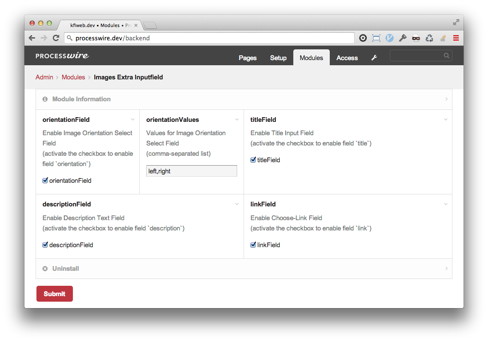
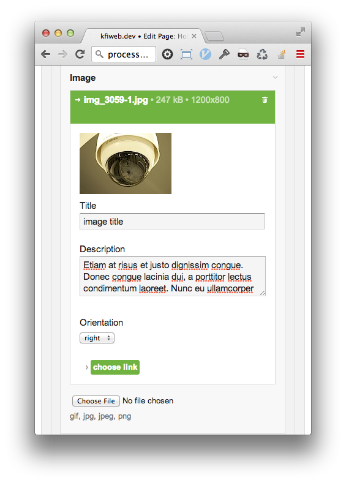

# ProcessWire Fieldtype Image Extra

## Overview:

Extends Filetype Image. Adds description, title, link and orientation.

Designed for use with ProcessWire 2.4
[http://processwire.com](http://processwire.com)

## Installation

1. Clone the module and place FieldtypeImageExtra in your site/modules/ directory. 

```
git clone https://github.com/justonestep/processwire-fieldtypeimageextra.git your/path/site/modules/FieldtypeImageExtra
```

2. Login to ProcessWire admin and click Modules. 
3. Click "Check for new modules".
4. Click "install" next to the new FieldtypeImageExtra module. 
5. That's all - no settings are required but possiblea. 

### You do not need all custom fields?

The following fields are available:

* orientation - image orientation
* orientation values - values to use as classnames or identifiers for different image orientations
* title - image title to use for title/alt tag or/and caption, if empty, the content will be generated from the applications filename
* description - image description
* link - image link to internal pages

If you don't need all custom fields, you can easily disable them:

1. Login to ProcessWire admin and click Modules.
2. Open `Images Extra Inputfield` Settings.
3. Just disable the desired fields.

The only exception is `orientationValues`.
Here you can insert identifiers for classnames or similar separated by comma.
This values will be available in a dropdown list.

## Usage

1. Under Setup and Fields create a new field using type ImageExtra.
2. After entering the new field name and label, click Save.
3. Configure it depending on your own needs.
4. Save.
5. Add your new field to one or more Templates.

## Accessing the value

This is no different than accessing the value of any other field.

```
	echo $img->title;
	echo $pages->get($img->link)->url
```

For use with [TemplateTwigReplace](http://modules.processwire.com/modules/template-twig-replace):

```
	{{image.title}}
	{{pages.get(image.link).url}}
```

## Screenshots

**Module `Images Extra Inputfield` Settings**



**Field Image Extra**


